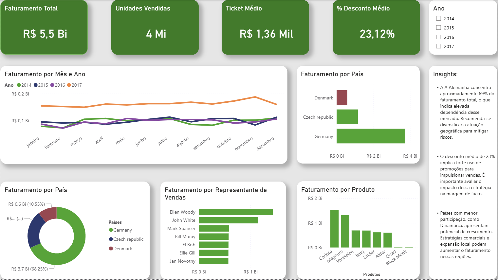

# Cocoa Nuts Sales Dashboard

Projeto desenvolvido em Power BI como parte de um case prático de análise de dados para o Workshop da EBAC - Escola Britânica de Artes Criativas e Tecnologia.

## Objetivo:

Criar um dashboard interativo para análise de vendas, permitindo identificar:
- Sazonalidade;
- Regiões com melhor e pior desempenho;
- Produtos mais relevantes;
- Performance de vendas.

## Dashboard

## Tecnologias utilizadas:
- Power BI;
- DAX;
- Modelagem de dados (Star Schema).

## Principais insights:
- A Alemanha concentra a maior parte do faturamento (~69%), indicando alta dependência desse mercado;
- O desconto médio de 23% sugere forte uso de promoções;
- Países com menor participação apresentam oportunidade de crescimento.

## Arquivo
- `case1-cocoa-nuts.pbix`
